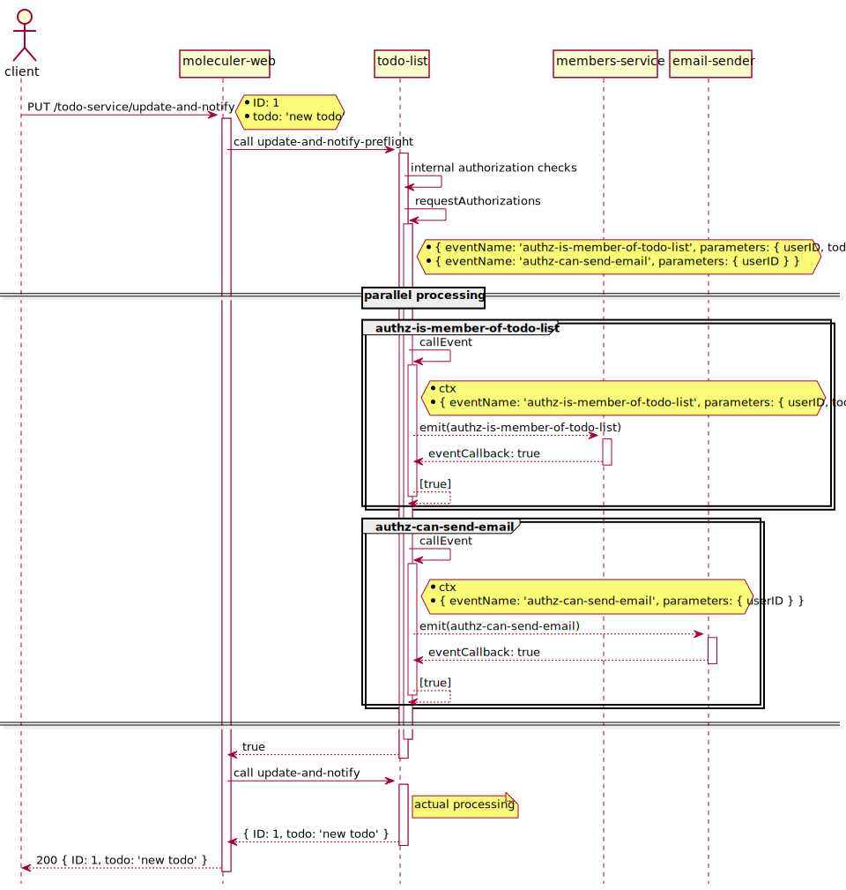

:source-highlighter: highlightjs
:sectnums:
:toc: left

ifdef::env-github[]
:tip-caption: :bulb:
:note-caption: :information_source:
:important-caption: :heavy_exclamation_mark:
:caution-caption: :fire:
:warning-caption: :warning:
endif::[]

= Moleculer authorization helpers

== Rationale

The current authorization strategy used by the R2D2 stack is to operate a preflight from the API gateway before it actually calls an action of a backend service.
These preflight actions can either decide themselves if the call is authorized or ask other services for an authorization.

These requests are sent through Moleculer events.
Services subscribing to these events will either reply with a boolean (`true` = authorized, `false` = forbidden) or will not reply if they cannot answer (`undefined` answer).
An authorization request is considered successful if at least one service has authorized the request and no service has forbidden the request (which means that if nobody answered, the request is implicitly forbidden).

[NOTE]
====
Events are used instead of actions as the authorization requester does not necessarily know which service answers its authorization requests.
Moreover, multiple services could be responsible to answer one authorization request.
====

=== Use case

The following example considers a shared todo list service.
This service exposes an action to update a todo item and notify by email the todo list members of this update. +
Depending on the user, the email sender will authorize or not the notification.

The following services are at play:

* todo-list: manage todo lists 
* email-sender: send emails
* members-service: manage users
* moleculer-web: expose actions

== Helpers

Currently, this library provides the following helpers:

* `addPreflightMixin` to build and add a preflight mixin in a service schema
* `isAuthorized` to decide whether one or more authorization requests have all succeeded based on the answers provided by the subscribers
* `requestAuthorizations` to send multiple authorization requests at once

=== `addPreflightMixin`

This helper adds a service mixin used to generate preflight actions for actions exposed through rest.
It takes a Moleculer service schema as a parameter and returns the same service schema with the mixin added.

This helper also adds the `callEventMixin` provided by https://www.npmjs.com/package/@r2d2bzh/moleculer-event-callback[@r2d2bzh/moleculer-event-callback].
`callEventMixin` injects a `$$callEvent` method to make authorization requests.
It also provides the callback action needed to receive the return value of authorization requests.

NOTE: A preflight action takes the same parameters as the original action.

To define a preflight handler, you must add a preflight attribute to an action:

[source,javascript]
----
{
  name: 'my-service',
  actions: {
    'my-action': {
      handler: myActionHandler(),
      rest: {},
      preflight: {
        handler: (ctx) => {
          // do preflight checks
          // possibly request for some authorizations through Moleculer events
        },
      },
    },
    'my-other-action': {
      handler: myOtherActionHandler(),
      rest: {},
      preflight: (ctx) => {},
    },
  },
}
----

[IMPORTANT]
====
Only actions where authorization is disabled do not enforce a preflight:

[source,javascript]
----
{
  'my-action': {
    handler: myActionHandler(),
    rest: {
      authorization: false,
    },
  },
}
----
==== 

=== `isAuthorized`

This helper decides whether or not something is authorized based on the answers to one or more authorization requests.
It implements the following rules:

* an authorization answer can be one of:
** `undefined`
** `Boolean`
** `Array`
** `Boolean[]`
** `Boolean[][]`
** `Boolean[][]...`
* `undefined` answers are ignored
* if any answer is `false`, the whole authorization process fails
* if no answer was provided, the whole authorization process fails

The signature of `isAuthorized` is `(logger) => (answer) => true | false`:

. the `logger` curried argument must provide a `warn` method used to issue warnings (default: `console`)
. the `answer` curried argument is the authorization answer(s) to one or many authorization requests

`isAuthorized` will raise a warning in the following cases:

* an odd authorization answer was provided, known answers are:
** `true`:: the request is authorized
** `false`:: the request is denied
** `undefined`:: the responder is not able to answer
* multiple `true` or `false` answers were provided to the same authorization request

=== `requestAuthorizations`

This helper operates multiple authorization requests at once and returns a promise which result can be handled by `isAuthorized`.

This helper uses the `$$callEvent` method provided by the `callEventMixin` of https://www.npmjs.com/package/@r2d2bzh/moleculer-event-callback[@r2d2bzh/moleculer-event-callback] (see `addPreflightMixin`).
This allows the retrieval of authorization requests return values.

[source,javascript]
----
requestAuthorization(moleculerContext)([
  { eventName: 'can-user-enter-car' },
  { eventName: 'can-user-start-car'}
]).then(isAuthorized); // true | false
----
